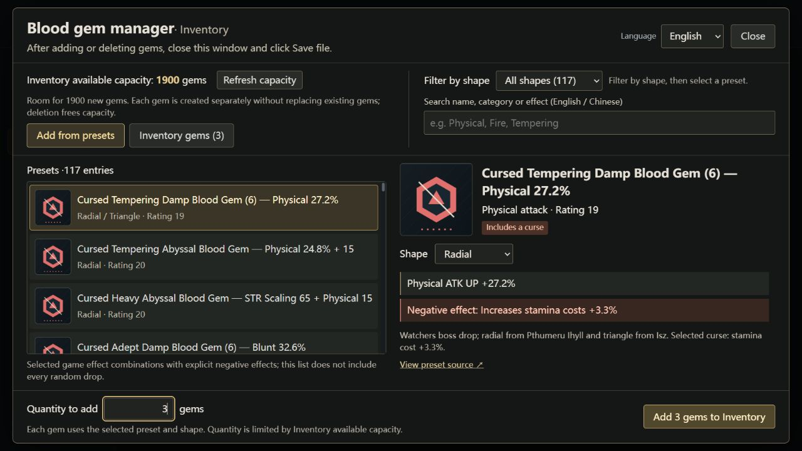

# Bloodborne Save Editor Gems

**English** | [简体中文](README.zh-CN.md)

[Download](https://github.com/Trit0N10/bloodborne-save-editor-gems/releases/latest)

A desktop editor for decrypted Bloodborne character saves, with a searchable blood-gem catalog and English / Simplified Chinese interfaces. It includes 117 gem presets and lets you add or remove gems in your inventory and storage.

Maintained by [Trit0N10](https://github.com/Trit0N10), based on [Noxde/Bloodborne-save-editor 0.10.0](https://github.com/Noxde/Bloodborne-save-editor). The save parser and most basic editing features come from the upstream project. This fork adds and maintains the expanded gem workflow, language switching, original graphics, and release tooling.



The screenshot uses synthetic data. [View the Simplified Chinese interface](docs/screenshots/gems.zh-CN.jpg).

## Features

- Search 117 blood-gem presets, filter by shape, and choose from 132 preset/shape combinations.
- Add gems by quantity or remove owned gems from inventory and storage. Capacity checks and independent record allocation help keep gem references consistent; unsupported layouts are rejected.
- Edit ordinary items, stats, character details, bosses, and event flags using the upstream editor's features.
- Switch between English and Simplified Chinese without reopening the save. English is the default on first launch; the language choice is remembered locally.
- Use original geometric icons. Game artwork, fonts, and narrative item descriptions are not included.

## Download and use

Download the **Windows x64 portable ZIP** from [the latest release](https://github.com/Trit0N10/bloodborne-save-editor-gems/releases/latest). Extract the entire archive, keep the `resources` folder beside **Bloodborne Save Editor Gems.exe**, and run the executable.

The app requires **Microsoft Edge WebView2 Runtime**. If it is missing, install it from [Microsoft](https://developer.microsoft.com/en-us/microsoft-edge/webview2/).

1. Exit the game and keep a separate backup of the save you want to edit.
2. Open a **decrypted character file**, such as `userdata0000`. `userdata0010` contains system data. The editor does not decrypt console saves.
3. Make your changes. **Manage blood gems** opens the preset search, shape filters, quantity controls, and gem deletion tools.
4. Click **Save file** and choose where to write the edited save. Changes stay in memory until you save.

Opening a supported file creates an `<input>.bak` backup. Reopening that input may overwrite the backup, so keep a separate recovery copy. Do not edit a save while the game is using it.

The release includes a source archive and `SHA256SUMS.txt`. Updates are downloaded from this repository's releases; automatic updates are disabled.

## Compatibility and testing

The release target is **Windows x64**. The app works with decrypted character files in the formats supported by the upstream parser. Gem creation also requires a supported registry layout; the editor rejects layouts it cannot validate.

Checks cover preset consistency, localization, selected gem allocation and deletion behavior using synthetic buffers, and frontend and native Windows builds. Interface checks use synthetic preview data. These checks do not cover every editing feature or establish compatibility with every save or game version. Real-save and in-game testing have not been completed for this release. See [testing details](docs/testing.md) and [the validation record](docs/release-validation.json).

The executable is unsigned. Test changes on a backed-up copy before replacing a save you rely on. No saves or game files are included.

## Build from source

Install **Node.js 22.12 or newer**, stable Rust, and the [Tauri Windows prerequisites](https://v2.tauri.app/start/prerequisites/), including MSVC C++ build tools and WebView2 Runtime. A game installation is not needed to build.

```powershell
npm ci
npm run check
npm run build
cargo test --locked --manifest-path src-tauri/Cargo.toml --lib publication_
npm run tauri -- build --no-bundle -- --locked
```

`./scripts/build-windows.ps1` runs the checks and builds the executable. `./scripts/package-release.ps1` packages the Windows app, corresponding source, and checksums in the ignored `release` directory.

The graphics are included in the source and can be regenerated with `node scripts/generate-artwork.mjs`. See [architecture](docs/architecture.md) and [asset provenance](docs/assets.md) for details.

## Credits and license

The upstream editor was created by **Noxde** and **Valentino Amato**. Their credits and the sources used for game-format metadata are preserved in [NOTICE](NOTICE.md). Gem presets also include reference links in the catalog.

This project is licensed under **GPL-3.0**; see [LICENSE](LICENSE). Redistributed binaries require corresponding source under the applicable GPL terms. Third-party dependencies retain their own licenses.

This is an unofficial project, with no affiliation to Sony Interactive Entertainment or FromSoftware. Bloodborne and related trademarks belong to their respective owners; the software license does not grant rights to game content or trademarks.
