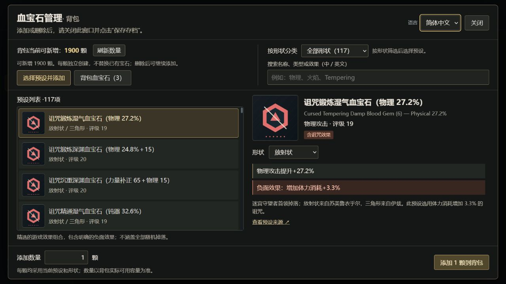

# 血源存档编辑器 · 血宝石版

[English](README.md) | **简体中文**

[下载](https://github.com/Trit0N10/bloodborne-save-editor-gems/releases/latest)

用于编辑已解密《血源诅咒》角色存档的桌面工具，支持英语和简体中文。内置 117 个血宝石预设，可检索、批量添加或删除背包与仓库中的宝石。

由 [Trit0N10](https://github.com/Trit0N10) 维护，基于 [Noxde/Bloodborne-save-editor 0.10.0](https://github.com/Noxde/Bloodborne-save-editor)。存档解析和多数基础编辑功能来自上游；本项目扩展并维护血宝石管理、语言切换、自制图形和发布工具。



截图使用合成数据。[查看英语界面](docs/screenshots/gems.en.jpg)。

## 功能

- 检索 117 个血宝石预设，按形状筛选，共有 132 个预设与形状组合。
- 按数量添加背包、仓库中的宝石，或逐颗删除已有宝石。新增前检查容量，为每颗宝石独立分配记录；无法验证的布局会拒绝修改。
- 使用上游编辑器的普通物品、能力、角色、头目和事件标记编辑功能。
- 在英语与简体中文之间切换，无需重新打开存档。首次启动默认英语，之后记住语言选择。
- 使用自制几何图标，不附带游戏原画、字体或物品背景故事描述。

## 下载与使用

在[最新发布页](https://github.com/Trit0N10/bloodborne-save-editor-gems/releases/latest)下载 **Windows x64 portable ZIP**。完整解压，保持 `resources` 文件夹与 **Bloodborne Save Editor Gems.exe** 同级，然后运行程序。

程序需要 **Microsoft Edge WebView2 Runtime**。若未安装，可从[微软官网](https://developer.microsoft.com/en-us/microsoft-edge/webview2/)下载。

1. 退出游戏，单独备份需要编辑的存档。
2. 打开**已解密的角色文件**，例如 `userdata0000`。`userdata0010` 是系统数据。本工具不提供主机存档解密功能。
3. 修改所需内容。「血宝石管理」提供预设检索、形状筛选、数量设置和删除功能。
4. 点击「保存存档」，选择输出位置。保存前的修改只保留在内存中。

打开受支持的文件时会生成 `<输入文件>.bak`。再次打开同一文件可能覆盖这份备份，请另外保留恢复副本。不要在游戏使用存档时编辑该文件。

发布页同时提供对应源码包和 `SHA256SUMS.txt`。新版本需从本仓库发布页下载，自动更新已禁用。

## 兼容性与测试

发布目标为 **Windows x64**。程序读取上游解析器支持格式的已解密角色存档。血宝石新增还需要符合受支持的注册表布局；无法验证的布局会被拒绝。

检查覆盖预设一致性、本地化、基于合成数据的部分宝石分配与删除流程，以及前端和 Windows 程序构建。界面检查也使用合成数据。这些检查尚未覆盖全部编辑功能，不能证明所有存档或游戏版本都兼容。本版本尚未完成真实存档和游戏内测试。详情见[测试说明](docs/testing.md)与[验证记录](docs/release-validation.json)。

程序没有数字签名。请先在备份副本上验证修改，再替换需要继续使用的存档。下载包不包含存档或游戏文件。

## 常见问题

[FAQ](docs/faq.zh-CN.md) 介绍下载包的选择、角色存档的打开、修改的保存和备份恢复，也说明为什么部分存档布局会被拒绝添加宝石。

## 帮助与问题反馈

先查看 FAQ 和[已有问题](https://github.com/Trit0N10/bloodborne-save-editor-gems/issues)。若仍无法解决，可以[提交问题反馈](https://github.com/Trit0N10/bloodborne-save-editor-gems/issues/new/choose)，选择简体中文表单，填写编辑器版本、Windows 版本、游戏／模拟器或移植版版本、完整报错和复现步骤。截图或日志有助于定位问题，发布前请去除个人信息。提交反馈不需要上传存档。

## 文档导航

| 文档 | 内容 |
| --- | --- |
| [常见问题](docs/faq.zh-CN.md) | 下载、存档文件、问题排查与备份恢复 |
| [更新记录](CHANGELOG.md)（英语） | 各版本的改动 |
| [发布页](https://github.com/Trit0N10/bloodborne-save-editor-gems/releases) | 下载文件与版本说明，提供简中入口 |
| [测试说明](docs/testing.md)（英语） | 检查命令、覆盖范围与验证限制 |
| [架构说明](docs/architecture.md)（英语） | 存档编辑与宝石注册表的实现 |
| [素材来源](docs/assets.md)（英语） | 自制图形与重新生成方法 |
| [致谢](NOTICE.md)（英语） | 上游作者及资料来源 |

## 从源码构建

安装 **Node.js 22.12 或更新版本**、Rust stable，以及 [Tauri Windows 构建依赖](https://v2.tauri.app/start/prerequisites/)，包括 MSVC C++ 工具和 WebView2 Runtime。构建无需安装游戏。

```powershell
npm ci
npm run check
npm run build
cargo test --locked --manifest-path src-tauri/Cargo.toml --lib publication_
npm run tauri -- build --no-bundle -- --locked
```

`./scripts/build-windows.ps1` 会执行检查并构建程序。`./scripts/package-release.ps1` 会在被 Git 忽略的 `release` 目录生成 Windows 便携包、对应源码包和校验文件。

图形素材已随源码提供，可用 `node scripts/generate-artwork.mjs` 重新生成。实现细节见[架构说明](docs/architecture.md)与[素材来源](docs/assets.md)。

## 致谢与许可证

上游编辑器由 **Noxde** 和 **Valentino Amato** 开发。原作者署名和存档格式资料的来源保留在 [NOTICE](NOTICE.md) 中，宝石预设也附有参考链接。

本项目采用 **GPL-3.0**，见 [LICENSE](LICENSE)。分发二进制程序时，需按适用的 GPL 条款提供对应源码。第三方依赖保留各自的许可证。

本项目为非官方工具，与索尼及 FromSoftware 无关联。《血源诅咒》及相关商标属于各自的权利人；软件许可证不授予游戏内容或商标的使用权。
